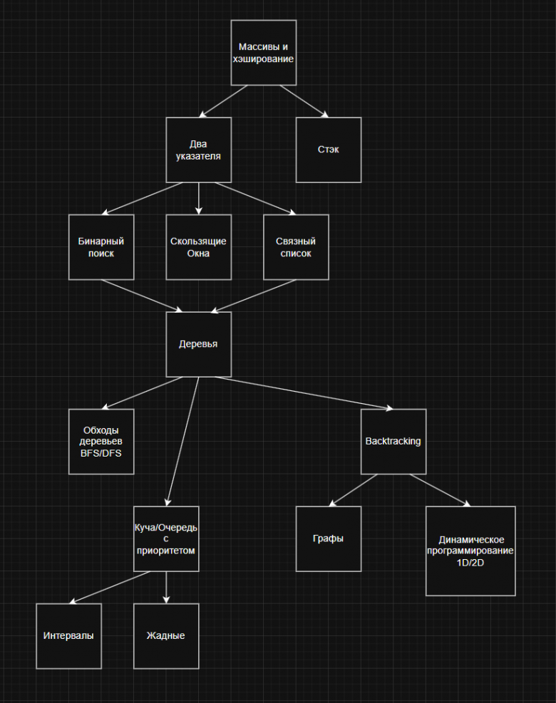

000000000000000000000000000000000000000000000000000000000000000 \
Мои решения. 

Массивы и хеширование ("Array\Коллекции с Hash"): \
[217] Easy. Contains Duplicate

Два указателя ("Two Pointers"): \
[125] Easy. Valid Palindrome

Стэк (Stack): \
[234] Easy. Palindrome Linked List

Бин. Поиск: \
[035] Easy. Search Insert Position

Sliding Window: \
[003] Medium. Longest Substring Without Repeating Characters \
0000000000000000000000000000000000000000000000000000000000000000 

Список задач на каждый алгоритм:: https://t.me/siliconchannel/71 

Массивы и хеширование: \
https://leetcode.com/problems/contains-duplicate/description/ \
https://leetcode.com/problems/valid-anagram/description/ \
https://leetcode.com/problems/two-sum/description/ \
https://leetcode.com/problems/top-k-frequent-elements/description/ 

Два указателя: \
https://leetcode.com/problems/valid-palindrome/description
https://leetcode.com/problems/remove-duplicates-from-sorted-array
https://leetcode.com/problems/linked-list-cycle/description
https://leetcode.com/problems/linked-list-cycle-ii/description

Стэк: \
https://leetcode.com/problems/valid-parentheses/description
https://leetcode.com/problems/palindrome-linked-list/description

Бин. Поиск: \
https://leetcode.com/problems/search-insert-position/description
https://leetcode.com/problems/sqrtx/description
https://leetcode.com/problems/two-sum-ii-input-array-is-sorted/description
https://leetcode.com/problems/search-in-rotated-sorted-array-ii/description 

Cкользяцие окна: \
https://leetcode.com/problems/contains-duplicate-ii/description
https://leetcode.com/problems/longest-substring-without-repeating-characters/description
https://leetcode.com/problems/minimum-window-substring/description

Связный список: \
https://leetcode.com/problems/merge-two-sorted-lists/description/
https://leetcode.com/problems/remove-nth-node-from-end-of-list/description/
https://leetcode.com/problems/add-two-numbers/description/
https://leetcode.com/problems/merge-k-sorted-lists/description/

Деревья: \
https://leetcode.com/problems/invert-binary-tree/description/
https://leetcode.com/problems/same-tree/description/
https://leetcode.com/problems/balanced-binary-tree/description/

BFS/DFS: \
https://leetcode.com/problems/maximum-depth-of-binary-tree/description/
https://leetcode.com/problems/binary-tree-preorder-traversal/description
https://leetcode.com/problems/binary-tree-postorder-traversal/description/

Backtracking: \
https://leetcode.com/problems/subsets/description/
https://leetcode.com/problems/combination-sum/description/
https://leetcode.com/problems/combination-sum-ii/description/

Куча/Очередь с приоритетом: \
https://leetcode.com/problems/kth-largest-element-in-a-stream/description/
https://leetcode.com/problems/last-stone-weight/description/
https://leetcode.com/problems/k-closest-points-to-origin/description/ 

Графы: \
https://leetcode.com/problems/number-of-islands/
https://leetcode.com/problems/max-area-of-island/ 
https://leetcode.com/problems/clone-graph/

ДП: \
https://leetcode.com/problems/climbing-stairs/
https://leetcode.com/problems/min-cost-climbing-stairs/
https://leetcode.com/problems/unique-paths/
https://leetcode.com/problems/longest-common-subsequence/

Интервалы: \
https://leetcode.com/problems/insert-interval/
https://leetcode.com/problems/merge-intervals/

Жадные алгоритмы: \
https://leetcode.com/problems/maximum-subarray/
https://leetcode.com/problems/jump-game/

